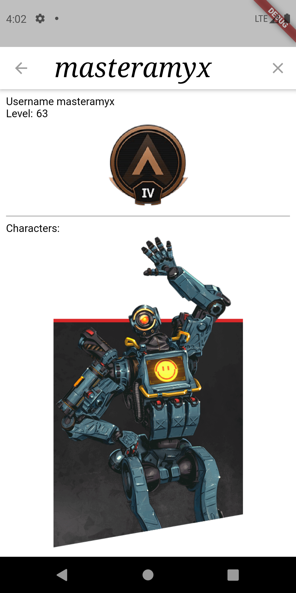

# empires

A Flutter application to view Apex Legends Player Stats. User can search across 3 platforms; Xbox, Playstation
and PC(Origin). Using this as a WIP to learn and experiment with flutter. Any improvements are welcome. 

#API

using [Apex Tracker](https://apex.tracker.gg)

GET https://public-api.tracker.gg/apex/v1/standard/profile/{PLATFORM}/{NAME}

Platforms: 1 = XBOX 2 = PSN 5 = Origin / PC

Home Screen:  

Search Screen:  

Result Screen:  

